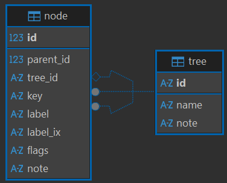

# TaxoStore

A simple tree store mainly designed for hierarchical taxonomies, implemented with PostgreSQL and served through an ASP.NET Core Web API.

## Overview

This solution contains a very simple store for node trees, backed by a PostgreSQL database. It allows you to create, read, update, and delete nodes in a tree structure. The store is then wrapped in an ASP.NET Core Web API for easy access.

The **tree** is just a named tree with a string ID (key), a human-friendly name, and an optional note.

The **node** is a simple structure with:

- a numeric ID and parent ID.
- a string tree ID (referencing the tree's key).
- a human-friendly ID string (key) that is unique only within its tree.
- a human-friendly label string and its searchable (filtered) counterpart.
- a set of flags where each character represents a boolean attribute.
- an optional note.



### Computed Position Properties

For tree visualization and navigation purposes, the API can compute and return additional properties:

- **Y (depth)**: The depth level of a node in the tree hierarchy (1-based). Root nodes have Y=1, their children have Y=2, and so on.
- **X (sibling position)**: The position of a node among its siblings (1-based), ordered alphabetically by key. The first sibling has X=1, the second X=2, etc.
- **HasChildren**: A boolean indicating whether the node has any children.

These properties are **computed at runtime** by the API layer, not stored in the database. This design choice avoids the overhead of maintaining these values during tree mutations (inserts, updates, deletes, moves), which would be particularly problematic with concurrent updates. Instead, the values are calculated on-demand when requested.

- **Single-node endpoints** (`GET /api/taxostore/nodes/{id}` and `GET /api/taxostore/nodes/tree/{treeId}/key/{key}`) always return the positioned model with X, Y, and HasChildren values.
- **Bulk endpoints** (children, descendants, ancestors, filtered queries) accept an optional `includePosition` query parameter. When set to `true`, X, Y, and HasChildren values are computed and included; otherwise they are omitted for better performance.

So, the note data essentially consists only in its identity and the corresponding human-friendly label, plus an optional note and a bunch of customizable flags. This is generic enough and fit to its primary purposes, which is providing taxonomies which can be either flat (when all nodes are root nodes) or hierarchical.

For instance, imagine a taxonomy like that of IconClass for iconographic "keywords". The taxonomy which will be used will use strings as identifiers for both trees and nodes. These will usually be meaningful IDs, like `christ.hand.right.up` for a node (where each dot here represents a step down the tree), and `iconography` for a tree; but this is up to the taxonomy we want to represent. The store is generic enough to represent any taxonomies, like e.g. product categories, where each category can have subcategories, and each category and subcategory can have a unique key and label.

> If you need to attach more data to nodes, you can further extend this project by adding new tables which provide more data payload attached to each node.

The intended first application of this project is having any number of massive editable taxonomies with high performance for read operations in those [Cadmus](https://vedph.github.io/cadmus-doc)-based projects which rely on huge taxonomies, and still allow users to edit the taxonomy when required.

### Identifiers

The project is designed to use numeric IDs for internal operations (primary keys, foreign keys) and human-friendly string keys for external references (e.g., API calls). This allows for efficient database operations while maintaining usability in external interfaces.

Trees have a unique string key (ID) that can be used to reference them externally, while nodes have a unique string key within their respective tree and internally just use a numeric ID, which is more compact and efficient.

So, a node key is granted to be unique only within its tree, not globally. If you want to have a globally unique node key (besides its numeric ID, which is internal to the database), you need to prefix it with the tree key followed by some separator, like a slash or a dot.

## Projects

- `TaxoStore.Core`: core interfaces and models.
- `TaxoStore.PgSql`: PostgreSQL implementation of the store.
- `TaxoStore.Api.Controllers`: ASP.NET Core Web API controllers and services for the store.
- `TaxoStore.Api`: ASP.NET Core Web API host for the store. This is essentially for demo and testing purposes, as usually consumer APIs will integrate the controllers from `TaxoStore.Api.Controllers` in their own host. This API also includes authentication and authorization using JWT bearer tokens, because the controllers require authentication.

## Integration Guide

This section explains how to integrate the TaxoStore into your ASP.NET Core Web API project. The integration follows ASP.NET best practices using the service extension pattern for clean, maintainable configuration.

> ⚠️ It is assumed that your ASP.NET Core Web API implements authentication, as the TaxoStore controllers require authenticated access.

The integration relies on three main components in the `TaxoStore.Api.Controllers.Services` namespace:

1. **TaxoStoreServiceOptions**: Configuration options for the store
2. **TaxoStoreServiceExtensions**: Extension methods for registering services
3. **TaxoStoreInitializationService**: Background service for automatic database initialization

### Step 1: Add Package References

Add packages to the required projects in your API's `.csproj` file (update version numbers accordingly):

```xml
<ItemGroup>
  <PackageReference Include="TaxoStore.Api.Controllers" Version="0.0.1" />
  <PackageReference Include="TaxoStore.Core" Version="0.0.1" />
  <PackageReference Include="TaxoStore.PgSql" Version="0.0.1" />
</ItemGroup>
```

### Step 2: Configure Connection String

Add the TaxoStore connection string to your `appsettings.json`:

```json
{
  "ConnectionStrings": {
    "TaxoStore": "Server=localhost;Database=trees;User Id=postgres;Password=postgres;Include Error Detail=True"
  },
  "TaxoStore": {
    "EnableAutoInitialization": true,
    "InitializationDelaySeconds": 0
  }
}
```

Configuration options in `TaxoStore`:

- `EnableAutoInitialization`: when `true`, automatically creates the database schema and seeds data on startup (default: `true`).
- `InitializationDelaySeconds`: delay before initialization starts, useful in Docker environments where PostgreSQL needs startup time (default: `0`).

### Step 3: Register TaxoStore Services

In your `Program.cs`, register the TaxoStore services and controllers:

```cs
using TaxoStore.Api.Controllers;
using TaxoStore.Api.Controllers.Services;

var builder = WebApplication.CreateBuilder(args);

// Add standard services
builder.Services.AddControllers();

// Register controllers from TaxoStore.Api.Controllers assembly
builder.Services.AddControllers()
    .AddApplicationPart(typeof(TreeController).Assembly)
    .AddControllersAsServices();

// Register TaxoStore services
builder.Services.AddTaxoStoreServices(options =>
{
    string? connectionString = builder.Configuration
        .GetConnectionString("TaxoStore");
    if (string.IsNullOrEmpty(connectionString))
    {
        throw new InvalidOperationException(
            "Connection string 'TaxoStore' not found.");
    }

    options.ConnectionString = connectionString;

    options.EnableAutoInitialization =
        builder.Configuration.GetValue("TaxoStore:EnableAutoInitialization", true);

    options.InitializationDelaySeconds =
        builder.Configuration.GetValue("TaxoStore:InitializationDelaySeconds", 0);
});

var app = builder.Build();

// Configure middleware
app.UseAuthorization();
app.MapControllers();

app.Run();
```

### Step 4: Optional - Seed Data from CSV Files

The TaxoStore supports automatic database seeding from CSV files. When the database is created for the first time, it will automatically import data from CSV files if they are present.

By default, `AddTreeServices` looks for seed files at:

- `wwwroot/trees/trees.csv`: tree definitions. Each tree is implicitly numbered with an ordinal when importing it, which makes it easier to refer nodes to it. The first imported tree is 1, the second 2, and so forth. So, in the nodes file you will refer to 1 for the first tree, 2 for the second, and so forth.
- `wwwroot/trees/nodes.csv`: node data.

If these files exist, they will be automatically used for seeding when the database is first created.

**CSV File Formats:**

- 📁 `trees.csv`:

```csv
id,name,note
products,Products,"Product taxonomy"
categories,Categories,"Category hierarchy"
```

- 📁 `nodes.csv`:

```csv
tree_n,parent_key,key,label,filtered_label,flags
1,,electronics,Electronics,electronics,
1,electronics,computers,Computers,computers,
1,electronics,phones,Mobile Phones,mobile phones,
2,,food,Food & Beverages,food beverages,
```

Fields in `trees.csv`:

- `id`: unique tree identifier (key), used to reference the tree externally.
- `name`: human-friendly display name for the tree.
- `note`: optional descriptive note about the tree.

Fields in `nodes.csv`:

- `tree_n`: tree number (1-based index from trees.csv).
- `parent_key`: key of the parent node (empty for root nodes).
- `key`: unique identifier within the tree.
- `label`: display label.
- `filtered_label`: searchable label (auto-generated if empty).
- `flags`: optional flags string.

> To specify custom paths for seed files:

```cs
builder.Services.AddTreeServices(options =>
{
    options.ConnectionString = builder.Configuration
        .GetConnectionString("TaxoStore")!;

    // Specify custom paths to CSV seed files
    options.SeedTreeSource = Path.Combine(
        builder.Environment.ContentRootPath, "Data", "my-trees.csv");

    options.SeedNodeSource = Path.Combine(
        builder.Environment.ContentRootPath, "Data", "my-nodes.csv");
});
```

Note:

- seeding only occurs when the database is **first created**.
- if the database already exists, seed files are ignored. To re-seed, drop the database and restart the application.
- the importer automatically generates filtered labels if not provided.

### Available API Endpoints

Once integrated, the following endpoints become available:

- **Tree Endpoints** (via `TreeController`):
  - `GET /api/taxostore/trees/{id}` - Get a tree by its ID (string key).
  - `GET /api/taxostore/trees` - Get paginated trees with filtering (query params: pageNumber, pageSize, name).
  - `POST /api/taxostore/trees` - Create or update a tree (body: TreeBindingModel with id, name, note).
  - `DELETE /api/taxostore/trees/{id}` - Delete a tree by its ID (string key).

- **Node Endpoints** (via `NodeController`):
  - `GET /api/taxostore/nodes/{id}` - Get a node by its numeric ID. Returns `PositionedNodeModel` with X/Y/HasChildren.
  - `GET /api/taxostore/nodes/tree/{treeId}/key/{key}` - Get a node by tree ID (string) and node key (string). Returns `PositionedNodeModel` with X/Y/HasChildren.
  - `GET /api/taxostore/nodes` - Get paginated nodes with filtering (query params: pageNumber, pageSize, treeId, parentId, key, parentKey, ancestorKey, filteredLabel, flags, flagMatchMode, isLeaf, includePosition).
  - `GET /api/taxostore/nodes/roots/{treeId}` - Get root nodes of a tree (query params: pageNumber, pageSize, includePosition).
  - `GET /api/taxostore/nodes/{id}/haschildren` - Check if a node has children (returns boolean).
  - `GET /api/taxostore/nodes/{id}/children` - Get child nodes of a parent node (query params: includePosition).
  - `GET /api/taxostore/nodes/{id}/descendants` - Get all descendant nodes of a node (query params: includePosition).
  - `GET /api/taxostore/nodes/{id}/ancestors` - Get all ancestor nodes of a node (query params: includePosition).
  - `POST /api/taxostore/nodes` - Create or update a node (body: NodeBindingModel with id, parentId, treeId, key, label, filteredLabel, flags, note).
  - `POST /api/taxostore/nodes/batch` - Bulk create or update nodes (body: array of NodeBindingModel).
  - `DELETE /api/taxostore/nodes/{id}` - Delete a node by its numeric ID.
  - `DELETE /api/taxostore/nodes` - Clear all data from the store.

> The `includePosition` query parameter (boolean, default `false`) controls whether X (sibling position), Y (depth), and HasChildren values are computed and included in the response. Set to `true` when position data is needed for visualization; omit or set to `false` for better performance when only node data is required.

### Docker Deployment

For Docker/containerized deployments where PostgreSQL may need startup time, configure an initialization delay:

```json
{
  "TaxoStore": {
    "EnableAutoInitialization": true,
    "InitializationDelaySeconds": 10
  }
}
```

This ensures the API waits for PostgreSQL to be ready before attempting initialization.

### Minimal Integration Example

Here's a complete minimal example:

```cs
using TaxoStore.Api.Controllers;
using TaxoStore.Api.Controllers.Services;

var builder = WebApplication.CreateBuilder(args);

builder.Services.AddControllers()
    .AddApplicationPart(typeof(TreeController).Assembly);

builder.Services.AddTaxoStoreServices(options =>
{
    options.ConnectionString = builder.Configuration
        .GetConnectionString("TaxoStore")!;
});

var app = builder.Build();
app.MapControllers();
app.Run();
```

With corresponding `appsettings.json`:

```json
{
  "ConnectionStrings": {
    "TaxoStore": "Server=localhost;Database=taxo;User Id=postgres;Password=postgres"
  }
}
```
